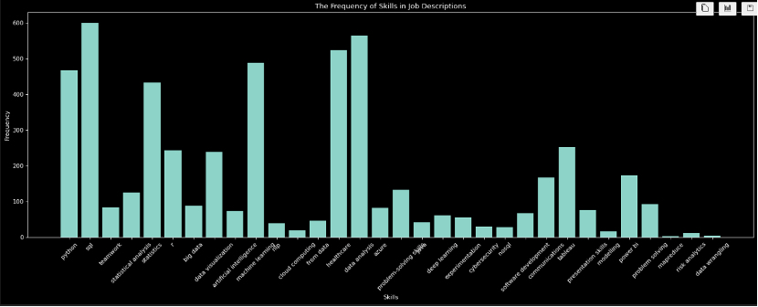
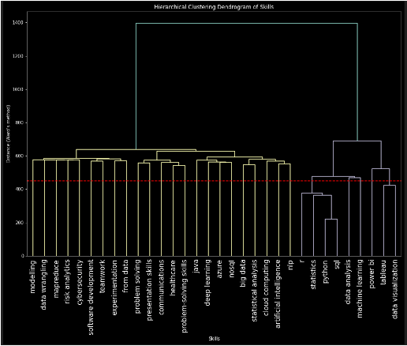

# Designing a Data Science & AI Master’s Curriculum via Job Postings Analysis

This repository implements an end-to-end project to design a course curriculum for a proposed “Master of Business and Management in Data Science and Artificial Intelligence” program at the University of Toronto. The curriculum is derived from an analysis of job vacancies collected from Indeed.com, where skills in high demand were extracted, quantified, and clustered using advanced Natural Language Processing (NLP) and unsupervised machine learning techniques.

The ultimate objective is to group similar skills into coherent courses and propose a logical, prerequisite-informed curriculum that covers both technical and soft skills required in the data science and AI industry.

---

## Table of Contents

- [Project Overview](#project-overview)
- [Data Collection and Cleaning](#data-collection-and-cleaning)
- [Exploratory Analysis and Feature Engineering](#exploratory-analysis-and-feature-engineering)
- [Clustering Approaches](#clustering-approaches)
  - [Hierarchical Clustering](#hierarchical-clustering)
  - [K-means (or DBSCAN) Clustering](#k-means-or-dbscan-clustering)
- [Course Curriculum Development](#course-curriculum-development)
- [Results and Visualizations](#results-and-visualizations)
- [How to Run the Notebook](#how-to-run-the-notebook)
- [Dependencies and Setup](#dependencies-and-setup)
- [Project Structure](#project-structure)
- [Future Enhancements](#future-enhancements)
- [License](#license)

---

## Project Overview

In today’s competitive job market, data science, analytics, and AI skills are in very high demand. This project leverages a custom web-scraping routine to extract job postings from Indeed.com focused on roles such as data scientists, data analysts, analytics managers, and directors of analytics in Canada and the USA. The scraped data (saved as `webscraping_results.csv`) includes key details like job title, company, location, job description, and salary.

Using a combination of manually defined skills (enhanced via ChatGPT) and NLP algorithms (including Spacy for frequency analysis and OpenAI’s API for text embeddings), the project engineers features that capture the prevalence and financial valuation of various skills.

Two distinct clustering methods are then applied:
- **Hierarchical Clustering:**  
  A custom distance measure based on skill co-occurrence is defined and visualized via a dendrogram to group skills. The resulting clusters are interpreted as potential courses.
- **K-means (or DBSCAN) Clustering:**  
  With a rich feature set (including numerical skill frequency, average salary, binary soft/hard indicators, and text embeddings), this approach is tuned (using the elbow method for optimal k) to form clusters that are subsequently mapped to courses.

Finally, the two clustering results are compared and integrated into a final, well-justified course curriculum, listing a sequence of 8–12 courses with at least three topics per course. This final curriculum balances broad foundational knowledge (from hierarchical clustering) with specialized skill clusters (from k-means).

---

## Data Collection and Cleaning

- **Web-scraping Adaptation:**  
  The provided web-scraping code was modified to target Indeed.com. The geographical scope was set to Canada and the USA, and the selection of job roles ensured that over 1,000 unique postings were gathered.
- **Data Fields:**  
  Extracted fields include job title, company, location, ratings, salary, job description, and posting URLs.
- **Cleaning Process:**  
  - Handling missing data: Salary fields and others with “N/A” are imputed using median (or filled with “Unknown” where appropriate).  
  - Text cleaning: HTML tags, non-ASCII characters, and inconsistent representations are corrected to create a structured, analyzable DataFrame.
- **Output:**  
  The cleaned dataset is saved as `webscraping_results.csv` for further analysis.

---

## Exploratory Analysis and Feature Engineering

- **Skill Extraction:**  
  - A two-pronged approach was employed: manually creating a list of relevant skills using domain knowledge and supplementing it with a skills list generated by OpenAI’s API.
  - NLP techniques (using Spacy and N-grams) were applied to job descriptions to count the frequency of each skill.
- **Feature Engineering:**  
  - Features such as skill frequency, average salary per skill, and a binary indicator for soft versus hard skills were calculated.
  - Additionally, text embeddings generated via OpenAI’s API were computed for at least one key text feature, providing a semantic representation to aid clustering.
- **Visualization:**  
  Two key graphs were generated:  
  1. A bar plot illustrating the frequency of skills across job postings.  
  2. A plot showing the relationship between skills and average salaries.

---


## Clustering Approaches

### Hierarchical Clustering

- **Binary Skills Matrix:**  
  A binary matrix representing the presence (1) or absence (0) of each skill across job postings was created.
- **Distance Matrix and Dendrogram:**  
  The co-occurrence matrix of skills was used to define a custom distance measure. Hierarchical clustering (using Ward’s method) was applied, and a dendrogram was generated to visualize the relationships.
- **Interpretation:**  
  Clusters from the dendrogram were manually inspected and used as a basis for proposing course groupings.

### K-means (or DBSCAN) Clustering

- **Feature Set:**  
  More than 10 features (including skill frequency, average salary, binary soft/hard indicators, and text embeddings) were engineered.
- **Scaling and Dimensionality Reduction:**  
  Features were standardized and reduced via PCA to ensure comparability.
- **Modeling:**  
  The elbow method was used to identify the optimal number of clusters (e.g., k = 4). K-means clustering was then applied, and clusters were interpreted as courses.
- **Outcome:**  
  Each resulting cluster represents a course, with at least three skills (topics) per course.

---

## Course Curriculum Development

Based on the clustering analyses, the following is an example of the proposed course curriculum (using the k-means results for specialization):

1. **Data Science Fundamentals:**  
   *Topics:* Data analysis, statistics, data wrangling, statistical programming
2. **Big Data and Cloud Technologies:**  
   *Topics:* Cloud computing, big data architectures, NoSQL databases, MapReduce
3. **Machine Learning and AI:**  
   *Topics:* Machine learning, artificial intelligence, deep learning, natural language processing
4. **Programming for Data Science:**  
   *Topics:* Python, R, Java
5. **Cybersecurity and Risk Management:**  
   *Topics:* Cybersecurity, risk analytics, data privacy, experimental design
6. **Data Visualization and Business Intelligence:**  
   *Topics:* Tableau, data visualization techniques, Power BI
7. **Software Development Practices:**  
   *Topics:* Software development life cycle, version control, agile methodology
8. **Communication and Problem-Solving:**  
   *Topics:* Communication skills, teamwork, critical problem solving
9. **Specialized Topics in Data Science:**  
   *Topics:* Healthcare analytics, advanced modeling, domain-specific skills

In the final report, the curriculum is further refined by combining elements from both clustering approaches to balance specialization with a solid foundational breadth.

---

## Results and Visualizations

- **Dendrogram (Hierarchical Clustering):**  
  Visualizes the distances between skills, helping to understand grouping relationships.
- **Elbow Plot and Scatter Plot (K-means):**  
  Displays the within-cluster sum of squares (WCSS) versus k and a scatter plot with cluster labels.
- **Course Mapping:**  
  Visual charts showing how clusters map into courses, illustrating the distribution of skills within each proposed course.
- **Discussion:**  
  A critical discussion of why the k-means curriculum was selected as optimal based on higher specialization and market alignment, while integrating the broad insights from hierarchical clustering.

---


## How to Run the Notebook

1. **Clone the Repository:**
   ```bash
   git clone https://github.com/yourusername/masters-curriculum-design.git
   cd masters-curriculum-design
   ```

2. **Upload the Scraped Data:**
   Place the `webscraping_results.csv` file in the repository root.

3. **Install Required Libraries:**
   ```bash
   pip install pandas numpy matplotlib seaborn scikit-learn spacy nltk openai
   ```

4. **Open the Notebook in Google Colab:**
   - Open `curriculum_design.ipynb` in Google Colab.
   - Use the following commands to upload your CSV file:
     ```python
     from google.colab import files
     uploaded = files.upload()
     ```

5. **Run All Cells:**
   - Restart the runtime and run all cells to reproduce the analysis.

---

## Dependencies and Setup

- **Python Version:** 3.x
- **Key Libraries:**
  - Data manipulation: `pandas`, `numpy`
  - Visualization: `matplotlib`, `seaborn`
  - Machine learning: `scikit-learn`
  - NLP and Text Processing: `spacy`, `nltk`, `openai`
  - Web-scraping: `selenium`, `BeautifulSoup4`

---

## Project Structure

```
masters-curriculum-design/
├── webscraping_results.csv   # Web-scraped job postings data
├── curriculum_design.ipynb       # Jupyter Notebook with complete analysis
├── README.md                             # This README file
└── Indeed_job_vacancies.csv      # vacant job data
```

---

## Future Enhancements

- **Automated Curriculum Synthesis:**  
  Explore advanced NLP (e.g., GPT-based summarization) to automatically generate course descriptions.
- **Alternative Clustering Methods:**  
  Experiment with DBSCAN or other algorithms for potentially improved cluster separation.
- **Interactive Visualizations:**  
  Utilize interactive plotting libraries (e.g., Plotly) to enable deeper exploration of skill clusters and curriculum mapping.
- **Longitudinal Analysis:**  
  Analyze changes in skill demand over time by incorporating historical job posting data.

---

## License

This project is licensed under the [MIT License](LICENSE).

---
